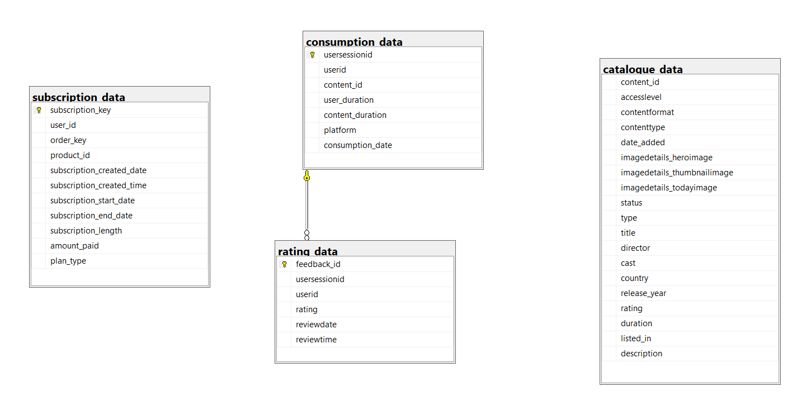
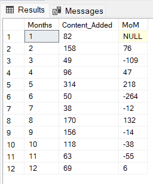
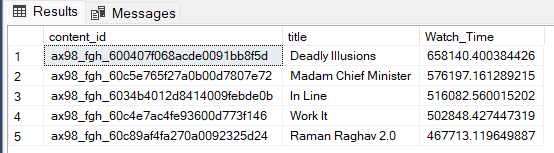
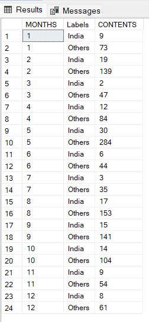
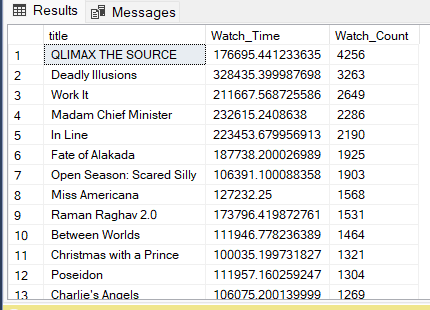
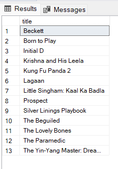

# 🎬 Streaming Platform SQL Case Study

## 📌 Project Objective
Analyze platform usage, subscription trends, content performance, and rating behavior from a fictional streaming dataset using SQL.

## 📂 Dataset Overview

The project is based on 4 fictional tables from a streaming platform:

- `catalogue_data`: Content metadata – title, country, release date, etc.  
- `consumption_data`: Tracks user watch time and platform activity
- `rating_data`: Records user sentiment (positive/negative) and timestamps for feedback.
- `subscription_data`: Monthly sign-up activity and platform usage per user.

These datasets simulate real-world streaming operations.

---

📊 **ER Diagram:**  

This diagram illustrates the relationship between content, consumption, rating, and subscription data.


---

## 🧠 Business Questions Answered

### 📊 Task 1 – Contextual Overview
1. Total number of content entries by region
2. All content which has been live for last 6 months.

### 💰 Task 2 – Subscription Insights
3. Monthly subscription trend using `LAG()`
4. Platform with most subscriptions
5. Estimated monthly revenue

### 🎥 Task 3 – Content Performance
6. Most viewed content
7. Platform with highest total watch time
8. India vs Global content contribution
9. Content to retire (low views + old)

### ⭐ Task 4 – Ratings & Feedback
10. Rating count by content type
11. Positive vs negative breakdown
12. Content never rated
13. Most liked content per region

---

## ❓ Highlighted Business Questions

### 🧩 T3.Q4. Monthly Content Trend

💻 **Method:**  
Used `LAG()` window function to compare current and previous month Content added by platform.

💻 **Query:**
```sql
SELECT Months, Content_Added, Content_Added - Prev_Content AS MoM
FROM (
     SELECT MONTH(date_added) AS Months, COUNT(title) AS Content_Added,
     LAG(COUNT(title), 1) OVER (ORDER BY MONTH(date_added)) AS Prev_Content
     FROM catalogue_data
     GROUP BY MONTH(date_added)
) AS X
```

📸 **Screenshot:**  


💡 **Insight:**  
 May saw the highest MoM growth of content addition whereas, it dropped the most in the month of June.

---

### 📊 T3.Q6. Top Viewed Content Overall

💻 **Method:**  
Aggregated total watch time across all content and sorted by ratings.

💻 **Query:**
```sql
SELECT TOP 5 T1.content_id, title, SUM(user_duration) AS Watch_Time
FROM catalogue_data AS T1
INNER JOIN consumption_data AS T2
ON T1.content_id = T2.content_id
INNER JOIN rating_data AS T3
ON T3.userid = T2.userid
       AND
T2.usersessionid = T3.usersessionid
WHERE T3.rating	IN ('AWESOME', 'GOOD')
GROUP BY T1.content_id, title
ORDER BY SUM(user_duration) DESC
```

📸 **Screenshot:**  


💡 **Insight:**  
Movie “Deadly Illusions” was the most viewed content across all platforms with highest watch time of "658140.400384426 mins"

---

### 🌍 T3.Q5. India vs Global Content Contribution

💻 **Method:**  
Used `CASE WHEN` to label content based on region field.

💻 **Query:**
```sql
SELECT MONTH(date_added) AS MONTHS, Labels, COUNT(title) AS CONTENTS
FROM (
	SELECT *,
	CASE
		WHEN country LIKE '%INDIA%'
				THEN 'India'
		ELSE  'Others'
	END as Labels
	FROM catalogue_data 
) AS X
GROUP BY MONTH(date_added) , Labels
ORDER BY MONTHS
```

📸 **Screenshot:**  


💡 **Insight:**  
Non-Indian content consistently outpaces Indian content monthly, with Indian titles never exceeding 30 per month.

---

### 🛑 T4.Q4. Content to Retire (Old + Low Views)

💻 **Method:**  
Filtered content on the basis if watch time and watch count.

💻 **Query:**
```sql
SELECT title, SUM(user_duration) AS Watch_Time, COUNT(C.userid) AS Watch_Count
FROM rating_data AS R
INNER JOIN consumption_data AS C
ON R.userid = C.userid
        AND
R.usersessionid = C.usersessionid
INNER JOIN catalogue_data AS CA
ON CA.content_id = C.content_id
WHERE R.rating IN ('TERRIBLE', 'DISMISSED', 'BAD')
GROUP BY title
ORDER BY Watch_Count DESC, Watch_Time ASC
```

📸 **Screenshot:**  


💡 **Insight:**  
1253 titles are underperforming — "QLIMAX THE SOURCE", "Deadly Illusions", "Work It" being the top 3 among them.

---

### ❌ T4.Q2. Unrated Content

💻 **Method:**  
Used `EXCEPT` to identify content with no rating feedback.

💻 **Query:**
```sql
SELECT title
FROM rating_data AS R
INNER JOIN consumption_data AS C
ON R.userid = C.userid
        AND
R.usersessionid = C.usersessionid
INNER JOIN catalogue_data AS CA
ON CA.content_id = C.content_id
WHERE R.rating = 'NOT_RATED'
EXCEPT
SELECT title
FROM rating_data AS R
INNER JOIN consumption_data AS C
ON R.userid = C.userid
        AND
R.usersessionid = C.usersessionid
INNER JOIN catalogue_data AS CA
ON CA.content_id = C.content_id
WHERE R.rating <> 'NOT_RATED'
```

📸 **Screenshot:**  


💡 **Insight:**  
13 pieces of content received zero ratings — likely under-promoted or unnoticed.

---

## 🗃️ Project Files

- `STREAMING_PLATFORM_ANALYSIS.sql` — All SQL queries grouped by business task
- `README.md` — This documentation file
- `/images/` — Screenshots of result outputs, ER Diagram

---

## 🙋‍♀️ About Me

I’m Kashish, an aspiring data analyst with hands-on experience in SQL and real-world business case studies. This is my second structured SQL project focused on content analytics.

📫 [LinkedIn](https://www.linkedin.com/in/kashish-kwatra)  
📁 [GitHub](https://github.com/KashishKwatra)
